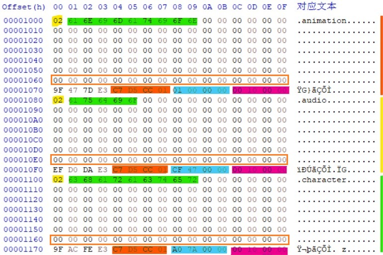
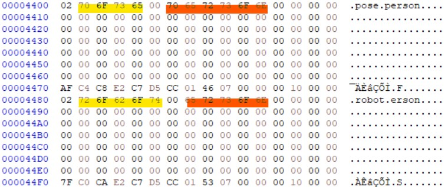

# UnPdeC

    使用 腾讯元宝，Kimi 辅助将C#版UnPde转换为C++版UnPdeC

    算是学习C++代码了，请勿用于任何商业目的！

## Build

    C++17 标准

    项目属性 -> 配置属性 -> 常规 -> C++ 语言标准

    改成 ISO C++17 标准 (/std:c++17)

## 测试程序

#### [UnPdeC.exe](TestRelease/UnPdeC.exe)

## 辅助工具

#### [PDE偏移值计算器](Tools/OffsetCalc.html)

    PDE偏移值与实际偏移值互转小工具

#### [XOR快速验证](Tools/FastXor.html)

    快速加解密验证小工具

#### [文件偏移值模糊计算器](Tools/XorShiftOffset.html)

    用来生成文件在目录中可能位置的小工具

## 线索

### 根目录
    0X1000 - 0X1FFF
    使用 FastXor.html 即可验证

### 文件信息

#### 类型 (黄色)
    01 = 文件
    02 = 目录

#### 文件名 (绿色)
    类型之后紧跟的就是文件名

#### 偏移值 (蓝色)
    相对位置在 0X78-0X7B

#### 大小 (紫色)
    相对位置在 0X7C-0X7F

#### 文件信息块特征1 (橙色)
    解密后可以观察到每个在目录中的"文件"都有一个标识?
    相对位置在 0X74-0X77

    在 C#版 UnPde中 TagsHash 中记录的就是这些标识？
    使用 XorShiftOffset.html 输入 C7D5CC01
    即可得到在不同位置下被加密的标识16进制值。

    一共32个这样的标识？因为解密时读取密钥的方式是循环读取
    密钥大小是 0X1000，每个"文件"都只占用0x80,所以只有32个标识？

#### 文件信息块特征2 (橙框)
    0X60 - 0X6F
    这个区域逻辑上是给名称用的
    但是大多数写不到这一行
    所以绝大部分(未验证)是00
    但是能搜索出20W条数据😊
    所以算是一个找文件信息块的特征吧

### 奇怪的地方

    正常来说文件名后面是00的话文件名就结束了
    有几处会出现00后面还有字符串？的情况
    0x2000 0x4000

### 文件特征码(原始加密状态)

    .anim
    1FD4E37B68D9E1CFFD14C367

    .lua / .occ
    1EDBE37B68D9E3CFFD14C367

    .tag / .dds
    1ED3E37B68D9E3CFFD14C367

    特殊的dds (noise3d.dds)
    1DD3E37B68D9E3CFFD14C367

    .dcl
    1FDDE37B68D9E0CFFD14C367

    .mesh
    1FD0E37B68D9EACFFD14C367

    .physx
    1FD6E37B68D9E7CFFD14C367

    .pd9
    1DD5E37B68D9E1CFFD14C367

    .vd9
    1ED5E37B68D9E1CFFD14C367

    .skel
    1FD7E37B68D9E1CFFD14C367

    .spr
    1FDCE37B68D9E2CFFD14C367

    .vfx
    1FD2E37B68D9E6CFFD14C367

    .fsb
    5982A14F

    .swf
    5C86B071

    .ttf
    1FD0E37B6ACBE3CFFD10C347FE910AB3
